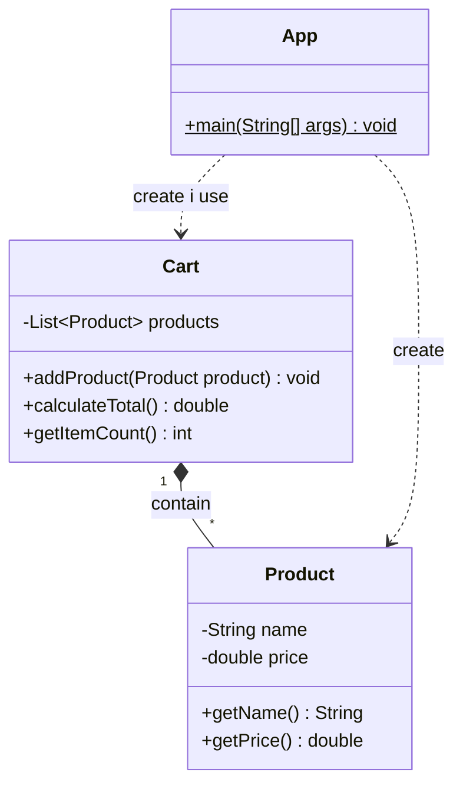

```mermaid
classDiagram
    class Product {
        -String name
        -double price
        +getName() String
        +getPrice() double
    }

    class Cart {
        -List~Product~ products
        +addProduct(Product product) void
        +calculateTotal() double
        +getItemCount() int
    }

    class App {
        +main(String[] args)$ void
    }

    Cart "1" *-- "*" Product : contain
    App ..> Cart : create i use
    App ..> Product : create
```